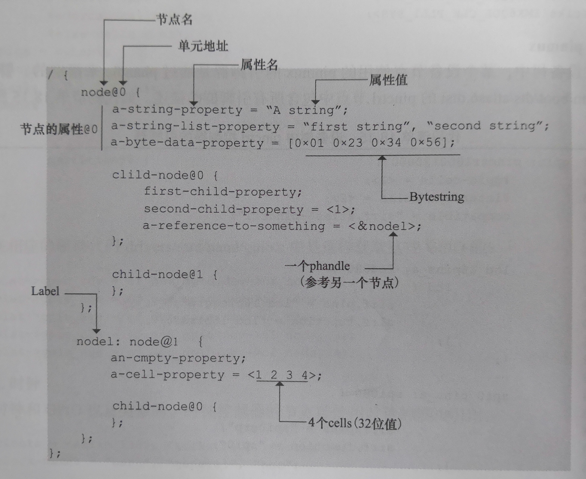

# Device Tree

## 参考文档

* [LinuxDTS](https://github.com/ZengjfOS/LinuxDTS)：相对于以前的板级文件的配置，Linux内核设备树（dts）成为了主流，记录学习过程。
* [Dynamic Device Tree](https://github.com/ZengjfOS/RaspberryPi/blob/master/docs/0012_Dynamic_Device_Tree.md)

## 简要说明

* 设备树是一种描述硬件的数据结构，他起源于OpenFirmware（OF），处理函数接口前缀也是`of`；
* 设备树由一系列被命名的节点（Node）和属性（Property）组成，而节点本身可包含子节点，所谓的属性，其实就是成对出现的名称和值；
* 设备树基本上就是化一颗电路板上CPU、总线、设备组成的树，Bootloader会将这棵树传递给内核，然后内核识别这棵树，并根据它展开Linux内核中的platform_device、i2c_client、spi_device等设备，而这些设备用到的内存、IRQ等资源，也被传递给了内核，内核会将这些资源绑定给展开的相应的设备；
* 支持 C/C++方式的注释；
* 基本缩写概念：
  * DTS：.dts文件, Deivce Tree Source；
  * DTC：Deivce Tree Compiler；
  * DTB：Deivce Tree Binary；
  * .dtsi：SoC公用的DTS部分，通过`/inclcude/`引入；
* 理解设备树，使用JSON数据格式来理解是不错的；
* root节点：`/`
  * 设备节点可以有子节点；
  * 设备节点属性可以是：
    * 空，只有key，没有值；
    * 字符串；
    * 字符串数组；
    * 字节数组；
    * uint32数组；
  * Linux内核通过根节点"/"的兼容属性（compatible）判断启动什么设备，这个属性一般包括两个或者两个以上的兼容性字符串，首个兼容性字符串是板级名字，后面一个兼容性是芯片或者芯片系列的名字；
  * 设备节点兼容属性（compatible）：驱动和.dts中描述的设备节点进行匹配，在驱动中也就意味着需要添加一个OF匹配表；
* Binding文档：对于设备树种的节点和属性具体是如何来描述设备的硬件细节，一般需要文档来进行讲解，文档的后缀名一般为.txt。在这个.txt文件中，需要描述对应节点的兼容性、必需的属性和可选的属性。这些文档位于内核的`Documentation/devicetree/bindings`目录下， 其下又分为很多子目录。譬如，`Documentation/devicetree/bindings/i2c/i2c-xiic.txt`描述了Xilinx的I2C控制器。
  * 文档中有`Required properties`，是必须属性；
  * 文档中有`Optional properties`，是可选属性；
  * 文档中有`Example`，简要示例；
* Bootloader
  * Uboot设备从v1.1.3开始支持设备树，其对ARM的支持则是和ARM内核支持设备树同期完成；
  * 为了使能设备树，需要在编译Uboot的时候在config文件中加入：`#define CONFIG_OF_LIBFDT`；
  * Uboot中，可以从NAND、SD或者TFTP等任意介质中将.dtb读入内存；
  * Uboot支持fdt命令，可以在Uboot对加载的设备树进行修改；
  * 对于ARM来说，可以通过`bootz kernel_addr initrd_address dtb_address`的命令来启动内核，即dtb_address作为bootz或者bootm的最后的一个参数，第一个参数为内核映像的地址，第二个参数为initrd的地址，如不存在initrd，可以用"-"符号代替；
